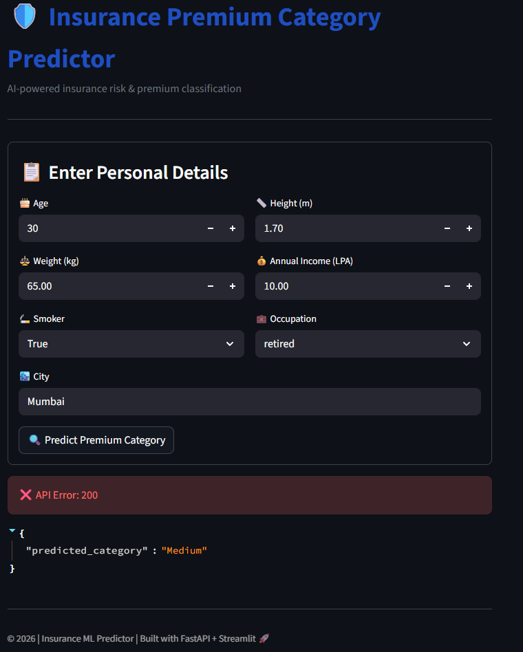
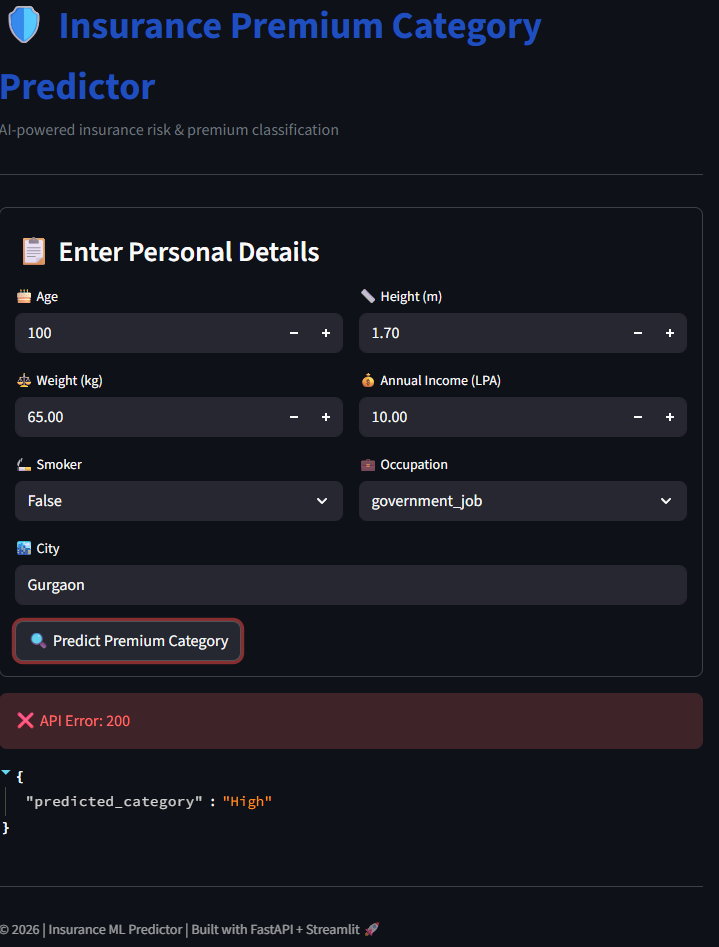

<h1 align="center">🛡️ Insurance Premium Category Predictor</h1>
   

  An end-to-end <strong>Machine Learning project</strong> that predicts insurance
  premium categories using a <strong>Random Forest model</strong>, deployed via
  <strong>FastAPI</strong> and consumed through an interactive
  <strong>Streamlit</strong> interface.

  
  
  
  

<h2>📌 Project Overview</h2>

Insurance premium determination depends on multiple factors such as age, income,
occupation, lifestyle habits, and geographic location.
This project applies a supervised machine learning approach to classify users
into premium categories such as <strong>Low</strong>, <strong>Medium</strong>,
and <strong>High</strong>.

The trained model is serialized using <strong>pickle</strong>, loaded into a
<strong>FastAPI</strong> backend with strict request validation via
<strong>Pydantic</strong>, and accessed through a clean and interactive
<strong>Streamlit</strong> web application.

<h2>⚙️ Technology Stack</h2>

<ul>
  <li><strong>Python</strong></li>
  <li><strong>scikit-learn</strong></li>
  <li><strong>Random Forest Classifier</strong></li>
  <li><strong>FastAPI</strong></li>
  <li><strong>Pydantic</strong></li>
  <li><strong>Streamlit</strong></li>
  <li><strong>Pickle (Model Serialization)</strong></li>
</ul>

<h2>🧠 Machine Learning Pipeline</h2>

<ul>
  <li>Data preprocessing and feature engineering</li>
  <li>Categorical encoding and numerical scaling</li>
  <li>Model training using Random Forest Classifier</li>
  <li>Model evaluation and validation</li>
  <li>Exporting trained model using pickle</li>
</ul>

 
<h2>🔁 End-to-End Workflow</h2>

<pre>
User Input (Streamlit UI)
        ↓
JSON Request
        ↓
FastAPI Backend
(Pydantic Validation)(PL)
        ↓
Preprocessing Pipeline
        ↓
Random Forest Model(RFM)
        ↓
Prediction + Confidence
        ↓
JSON Response
        ↓
Streamlit Visualization
</pre>

<h2>🚀 FastAPI Backend</h2>

<ul>
  <li>Loads serialized Random Forest model</li>
  <li>Validates incoming requests using Pydantic schemas</li>
  <li>Exposes a RESTful <code>/predict</code> endpoint</li>
  <li>Returns prediction, confidence score, and class probabilities</li>
  <li>Automatic API documentation using Swagger UI</li>
</ul>

<h2>🎨 Streamlit Frontend</h2>

<ul>
  <li>Interactive user input form</li>
  <li>Live communication with FastAPI</li>
  <li>Prediction result with confidence score</li>
  <li>Class probability visualization</li>
</ul>

<h2>📊 Sample API Output</h2>

<pre>
{
  "predicted_category": "Medium",
  "confidence": 0.87,
  "class_probabilities": {
    "Low": 0.08,
    "Medium": 0.87,
    "High": 0.05
  }
}
</pre>

<h2>🖼️ Output Preview</h2>

Here is what our Output looks like:

<h2>🌟 Why This Project Stands Out</h2>

<ul>
  <li>Real-world ML deployment architecture</li>
  <li>Clean separation of ML model, API, and UI</li>
  <li>Production-style validation and error handling</li>
  <li>Highly extensible and scalable design</li>
</ul>

  © 2026 • Insurance Premium Category Predictor 
  Built with ❤️ using Machine Learning, FastAPI & Streamlit

